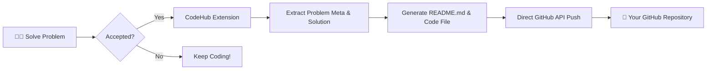
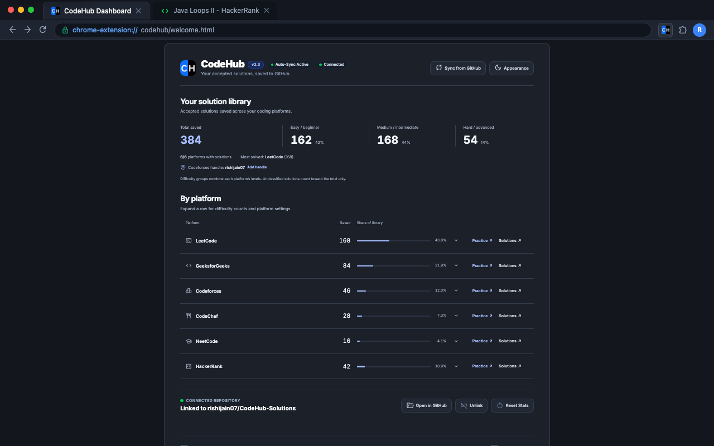
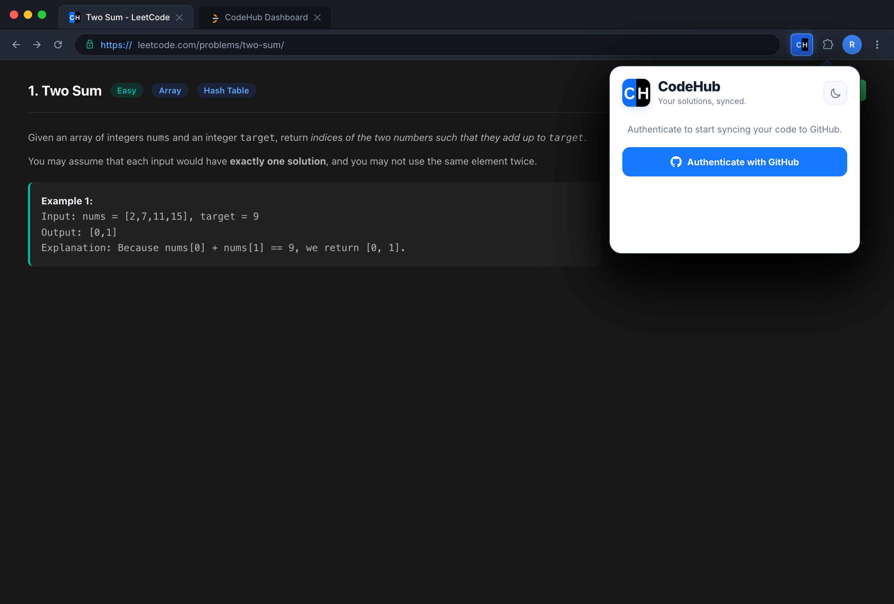
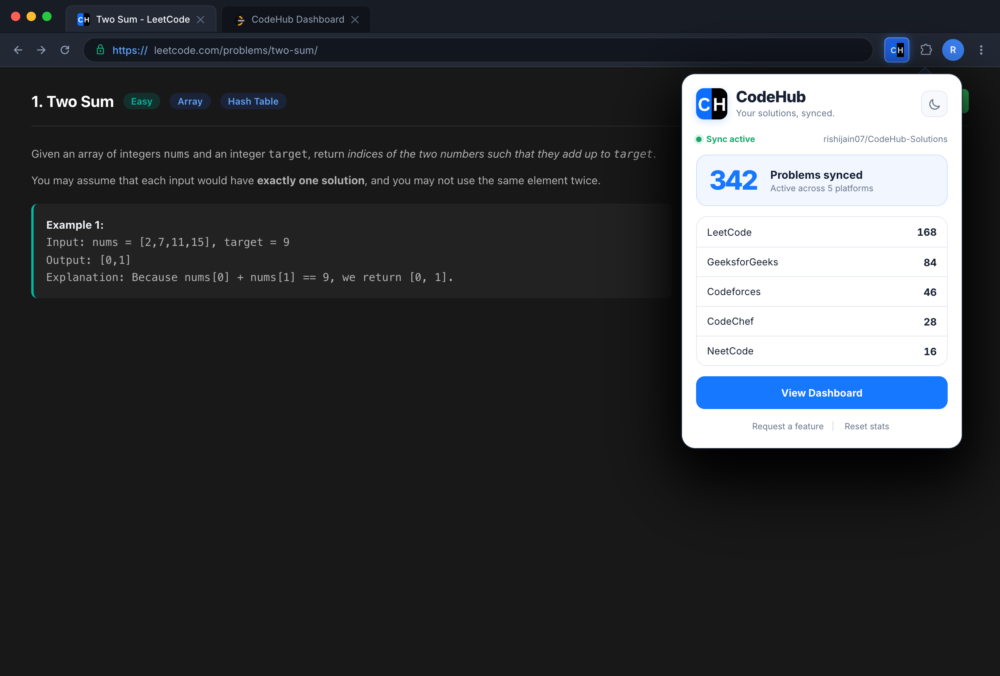
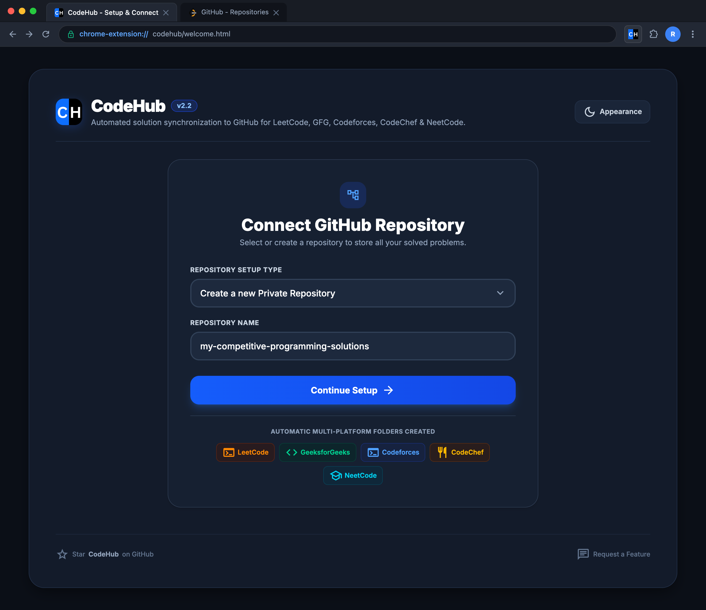
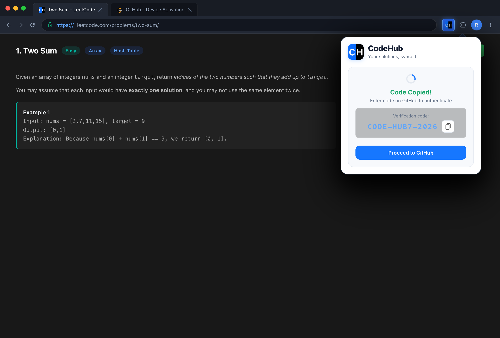

<div align="center">

  

  # CodeHub
  
  **Supercharge your competitive programming journey with automatic GitHub synchronization.**

  <p align="center">
    Seamlessly sync your solutions from <b>LeetCode</b>, <b>GeeksforGeeks</b>, <b>Codeforces</b>, <b>CodeChef</b>, <b>NeetCode</b>, and public <b>HackerRank</b> challenges directly into a single, beautifully organized GitHub repository.
  </p>

  <!-- Badges -->
  <p align="center">
    <a href="https://chromewebstore.google.com/detail/codehub/dgjlfbfaepcbokmgpicnngbdfckcloaf" target="_blank">
      
    </a>
    <a href="https://developer.chrome.com/docs/extensions/mv3/intro/">
      
    </a>
    <a href="#-privacy--security">
      
    </a>
  </p>

  <!-- CTA Buttons -->
  <p align="center">
    <a href="https://chromewebstore.google.com/detail/codehub/dgjlfbfaepcbokmgpicnngbdfckcloaf" target="_blank">
       <b>Install from Chrome Web Store</b>
    </a>
    &nbsp;&nbsp;•&nbsp;&nbsp;
    <a href="#-getting-started">
      🚀 <b>Quick Start Guide</b>
    </a>
    &nbsp;&nbsp;•&nbsp;&nbsp;
    <a href="#-privacy--security">
      🔒 <b>Privacy Policy</b>
    </a>
  </p>

</div>

---

## 📑 Table of Contents

- [💡 What is CodeHub?](#-what-is-codehub)
- [🌟 Supported Platforms](#-supported-platforms)
- [✨ Key Features](#-key-features)
- [🔄 How It Works](#-how-it-works)
- [📁 Repository Structure](#-repository-structure)
- [🚀 Getting Started](#-getting-started)
- [📸 Screenshots & UI Preview](#-screenshots--ui-preview)
- [🔒 Privacy & Security](#-privacy--security)
- [📬 Support & Feedback](#-support--feedback)

---

## 💡 What is CodeHub?

**CodeHub** is a modern, lightweight, and privacy-focused browser extension designed for developers and competitive programmers.

Never lose track of your accepted solutions again. Whenever you solve a problem on any supported platform, CodeHub instantly captures your code, parses problem details (difficulty, tags, problem statements), and automatically commits everything to your personal GitHub repository — cleanly structured and beautifully documented.

```
 Solve Problem ➔ Pass Test Cases ➔ CodeHub Intercepts ➔ Auto-Committed to GitHub!
```

---

## 🌟 Supported Platforms

| Platform | Badge | Output Folder | Sync Method |
| :--- | :---: | :--- | :--- |
| **[LeetCode](https://leetcode.com/)** |  | `leetcode/` | Instant Submission Hook |
| **[GeeksforGeeks](https://geeksforgeeks.org/explore)** |  | `geeksforgeeks/` | Instant Submission Hook |
| **[Codeforces](https://codeforces.com/)** |  | `codeforces/` | Automatic Background Sync (via Handle) |
| **[CodeChef](https://www.codechef.com/)** |  | `codechef/` | Instant Submission Hook |
| **[NeetCode](https://neetcode.io/)** |  | `neetcode/` | Instant Submission Hook |
| **[HackerRank](https://www.hackerrank.com/)** |  | `hackerrank/` | Instant Submission Hook (public challenges) |

---

## ✨ Key Features

- ⚡ **Zero-Interruption Instant Sync**: Submissions on LeetCode, GFG, CodeChef, NeetCode, and public HackerRank challenges are synced immediately when you pass all test cases without disrupting your flow.
- 🟣 **HackerRank Fullscreen Support**: Fullscreen challenge URLs can hide difficulty metadata, so CodeHub falls back to the canonical `/challenges/<slug>/problem` page and records the correct Easy/Medium/Hard rating.
- 🛡️ **Public-Challenge Boundary**: HackerRank Practice/Prepare and anonymously public contest challenges are supported; hiring assessments, tests, and interview pages are excluded.
- 🏆 **Automated Codeforces Background Tracker**: Periodically tracks your solved contest and practice problems on Codeforces via your handle.
- 📊 **Unified Cross-Platform Analytics Hero**:
  - **Global Solved Counter**: Real-time counter aggregating total solved problems across all platforms.
  - **Difficulty Breakdown**: Standardized metrics for **Easy**, **Medium**, and **Hard**.
  - **Platform Activity Share**: Interactive visual distribution bar highlighting your platform engagement across six platforms.
- 📂 **Auto-Generated Problem Documentation**: Every committed solution includes a detailed problem `README.md` containing description, tags, time/space constraints, and difficulty badges.
- 🎯 **1-Click Platform Navigation**: Jump directly to platform subdirectories (`/leetcode`, `/geeksforgeeks`, `/codeforces`, etc.) in your repository straight from the extension popup.
- 🔄 **On-Demand GitHub Re-Sync**: Synchronize local statistics with your repository's `stats.json` anytime with a single click.
- 🌓 **Sleek Light & Dark Themes**: Modern, high-contrast, accessible UI tailored for day or night coding sessions.
- 🔒 **Strict Zero-Server Privacy**: Operates 100% on the client side using official GitHub APIs and public platform pages. No intermediate servers, databases, or third-party trackers.

---

## 🔄 How It Works



---

## 📁 Repository Structure

CodeHub organizes your repository systematically so you can easily review, search, and showcase your solutions:

```tree
your-solutions-repo/
├── stats.json                   # Aggregated stats tracked across platforms
├── leetcode/
│   └── 0001-two-sum/
│       ├── README.md            # Problem description, tags & complexity
│       └── Solution.cpp         # Your accepted code
├── geeksforgeeks/
│   └── Subarray-with-given-sum/
│       ├── README.md
│       └── solution.java
├── codeforces/
│   └── 4A-Watermelon/
│       ├── README.md
│       └── solution.py
├── codechef/
│   └── CHEFSTR1/
│       ├── README.md
│       └── solution.cpp
├── neetcode/
    └── valid-anagram/
        ├── README.md
        └── solution.py
└── hackerrank/
    ├── cpp-hello-world/
    │   ├── README.md
    │   └── solution.cpp
    └── stats.json
```

---

## 🚀 Getting Started

Getting started with CodeHub takes less than a minute!

### Step 1: Install the Extension
Install **CodeHub** directly from the [Chrome Web Store](https://chromewebstore.google.com/detail/codehub/dgjlfbfaepcbokmgpicnngbdfckcloaf).

### Step 2: Authenticate with GitHub
1. Click the **CodeHub** icon in your browser toolbar.
2. Click **"Authenticate with GitHub"** to launch the secure device authorization flow.
3. Enter the one-time code on GitHub to authorize CodeHub.

### Step 3: Configure Your Repository
1. Select an existing repository or create a new one (e.g., `competitive-programming-solutions`).
2. *(Optional)* Add your **Codeforces handle** to activate background sync for Codeforces submissions.

### Step 4: Solve & Auto-Sync
Solve any problem on LeetCode, GFG, Codeforces, CodeChef, NeetCode, or a public HackerRank challenge. Once your solution gets accepted, CodeHub automatically commits it to your GitHub repository!

For HackerRank, submit from the normal challenge or fullscreen URL. CodeHub reads the active editor, writes the solution and README, and obtains missing difficulty metadata from the canonical non-fullscreen problem URL. Temporary metadata or GitHub failures are retried; previously stored `Unknown` HackerRank difficulty values can be repaired on a later accepted submission.

---

## 📸 Screenshots & UI Preview

<div align="center">
  <h3>📊 Unified Analytics & Problem Distribution</h3>
  
</div>

<br>

<div align="center">
  <table width="100%">
    <tr>
      <td width="50%" align="center">
        <b>🔐 Seamless GitHub Device Flow Auth</b><br><br>
        
      </td>
      <td width="50%" align="center">
        <b>⚡ Quick Popup Stats & Navigation</b><br><br>
        
      </td>
    </tr>
    <tr>
      <td width="50%" align="center">
        <b>👋 Welcome & Setup Experience</b><br><br>
        
      </td>
      <td width="50%" align="center">
        <b>🔑 1-Click Code Verification</b><br><br>
        
      </td>
    </tr>
  </table>
</div>

---

## 🔒 Privacy & Security

We believe your code and credentials belong only to you:

- 🛡️ **No Backend Servers**: CodeHub does not store or process your code on any third-party servers.
- 🔑 **Secure Local Storage**: GitHub authentication tokens and configurations are stored solely in your browser's isolated `chrome.storage.local`.
- 🌐 **Direct API Communication**: All requests communicate directly and securely via HTTPS with the official GitHub API (`api.github.com`), Codeforces API (`codeforces.com/api`), and public HackerRank challenge pages.
- 🧹 **Total Control**: You can unlink your repository, reset cached stats, or uninstall the extension at any time to immediately purge all local data.

For full details, please refer to our [Privacy Policy](privacypolicy.txt).

---

## 📬 Support & Feedback

If you encounter any issues, have feedback, or want to suggest improvements:
- ⭐️ **Rate & Review**: Leave a review on the [Chrome Web Store](https://chromewebstore.google.com/detail/codehub/dgjlfbfaepcbokmgpicnngbdfckcloaf).
- 📧 **Direct Contact**: Reach out via email at [beingrishijain@gmail.com](mailto:beingrishijain@gmail.com).

---

<div align="center">
  <sub>Built with ❤️ by <a href="https://github.com/rishijain07">Rishi Jain</a>.</sub>
</div>
